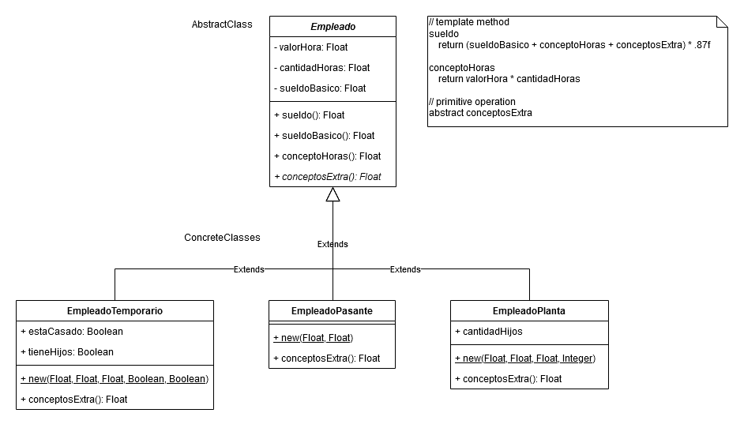
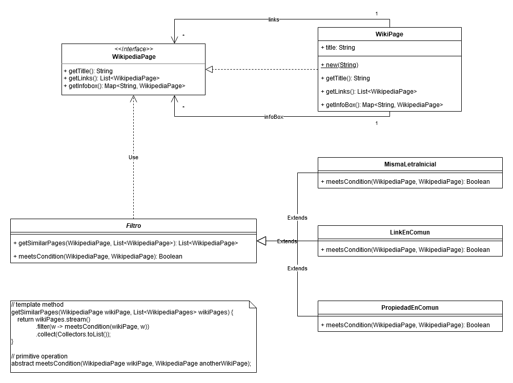

# TP06 - Template Method y Adapter

## 1. Lea el Template Method y Responda

- La clase abastracta implementa el template method que define el esqueleto del algoritmo
- El esqueleto no puede redefinirse
- Las operaciones primitivas (abstractas) y los hook methods que invoca el template method son las que pueden redefinirse
- Un hook method es un método concreto definido en la clase abstracta que puede ser redefinido en las subclasses para cambiar parte del comportamiento del template method

## 2. Sueldos Recargado

Roles

- Clase abstracta: `Empleado`
- Clases concretas:
  - `EmpleadoTemporario`
  - `EmpleadoPasante`
  - `EmpleadoPlanta`
- Template method: `Empleado::sueldo`
- Operación primitiva abstracta: `Empleado::conceptosExtra`
- Operaciones primitivas concretas:
  - `EmpleadoTemporario::conceptosExtra`
  - `EmpleadoPermanente::conceptosExtra`
  - `EmpleadoPlanta::conceptosExtra`

## 3. Elementos Similares

Roles

- Clase abstracta: `Filtro`
- Template method: `Filtro::getSimilarPages`
- Operación primitiva: `Filtro::meetsCondition`
- Clases concretas:
  - `MismaLetraInicial`
  - `LinkEnComun`
  - `PropiedadEnComun`
- Operaciones primitivas concretas:
  - `MismaLetraInicial::meetsCondition`
  - `LinkEnComun::meetsCondition`
  - `PropiedadEnComun::meetsCondition`

## 4. Llamadas Telefónicas

Roles:

- Clase abstracta: `LlamadaTelefonica`
- Template method: `LLamadaTelefonica::costoFinal`
- Operación primitiva abstracta: `LLamadaTelefonica::esHoraPico`
- Hook method: `LLamadaTelefonica::costoNeto`
- Clase concreta: `LlamadaDescuento`
- Operación primitiva concreta: `LLamadaDescuento::esHoraPico`
- Hook method redefinido: `LLamadaDescuento::costoNeto`

## 5. Ayudando al Soberano

Roles:

- Clase abstracta: `CuentaBancaraia`
- Template method: `CuentaBancaria::extraer`
- Operación primitiva abstracta: `CuentaBancaria::puedeExtraer`
- Clases concretas:
  - `CuentaCorriente`
  - `CajaDeAhorror`
- Operación primitiva concreta:
  - `CuentaCorriente::puedeExtraer`
  - `CajaDeAhorro::puedeExtraer`
