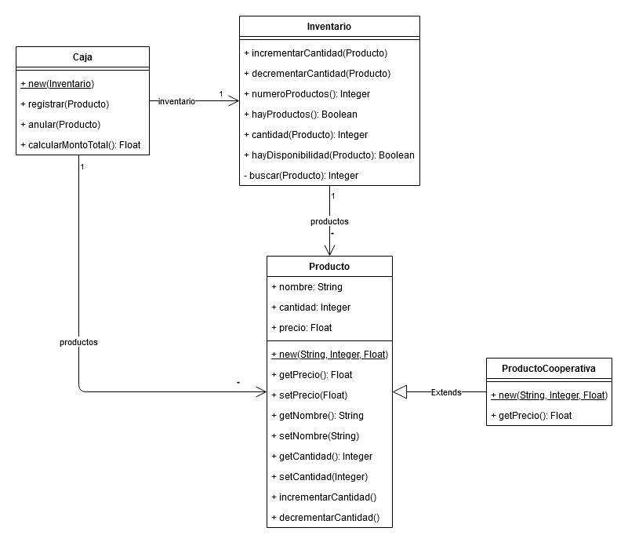
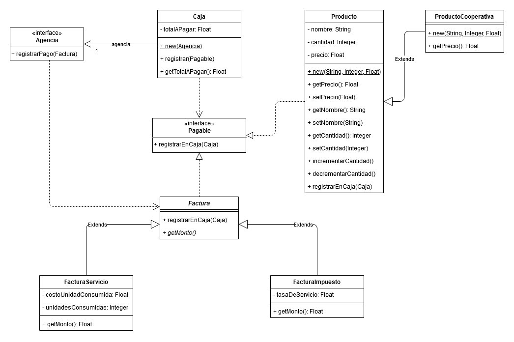

# TP04 - Clases Abstractas e Interfaces

## 1. Actividad de Lectura: Clases Abstractas e Interfaces

- ¿Qué ventajas, en cuanto a polimorfismo, brindan las interfaces en Java?

  - Las interfaces en Java nos brindan herencia múltiple de tipos, que es la habilidad de una clase de implementar muchas interfaces. Un objeto puede tener múltiples tipos, el tipo de su propia clase y los tipos de todas las interfaces que implemente. Esto quiere decir que si se utiliza el una interfaz para declarar el tipo de una variable, entonces su valor puede referenciar cualquier objeto que haya sido instanciado desde cualquier clase que implemente dicha interfaz.

- ¿Por qué no siempre puedeo utilizar clases abstractas para agrupar clases polimórficas?

  - Las clases abstractas pueden definir propiedades que no siempre describen a todos los objetos que queremos que se comporten polimórficamente. En este caso particular nos convendría utilizar interfaces ya que los único que requieren es que se implemente el comportamiento definido por las mismas.

- ¿Qué ventajas tienen las clases abstractas sobre las interfaces?

  - Las clases abstractas nos dejan definir propiedades y comportamiento por defecto, algo que las interfaces no permiten.

- ¿Se puede instanciar una intefaz?

  - No.

- ¿Por qué no es recomendable incrementar o modificar las firmas declaradas en una interfaz?

  - No es recomendable porque hacerlo nos obligaría a alterar de igual manera el comportamiento de todas las clases que la implementen.

- ¿Por qué, en lenguajes como Smalltalk, no es necesaria la implementación de interfaces?

  - No es necesaria porque Smalltalk hace uso de tipado dinámico. Esta forma de tipado nos facilita la implementación de tipos polimórficos con solo implementar los mensajes que nos interesen para garantizar que dos clases diferentes compartan el mismo protocolo y así se comporten de la misma forma.

## 2. La Caja del Mercado Central

Ver implementación Java.

## 3. La Caja del Mercado Central - Parte 2

Ver implementación Java.

## 4. Interfaces, Colecciones y Otras Yerbas

- ¿Qué ocurriría si utiliza en lugar de XXX, YYY, WWW y ZZZ las clases e interfaces recientemente estudiadas?

  - Si usara `Collection` como interfaz junto con cualquiera de las clases `ArrayList` o `LinkedList`, no podría utilizar el método `subList` ya que no es definido por la interfaz `Collection`. En cambio si eligiera utilizar la interfaz `List`, sí podría hacerlo ya que es definida por la misma.

## 5. De Smalltalk a Java

Pendiente
