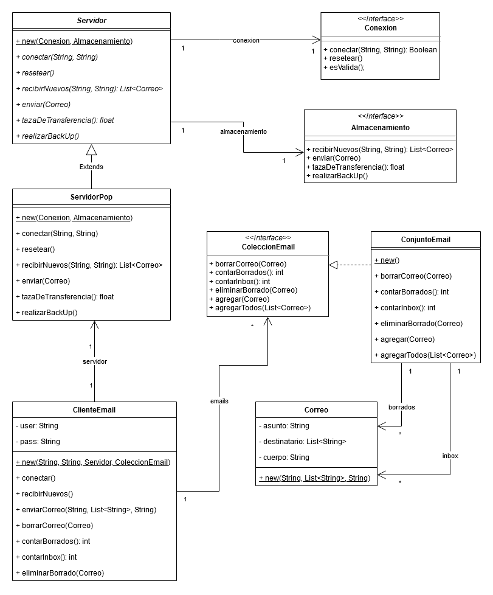
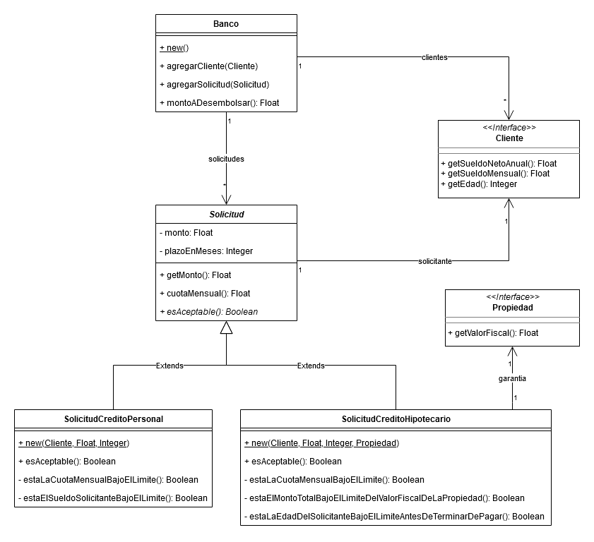

# TP05 - SOLID

## 1. Cliente de Email

- Violaciones detectadas:

  - `IServidor`:

    - SRP: tiene más de una responsabilidad

      - Manipulación de conexiones (conectar/reiniciar)
      - Administración de datos (tasa de transferencia/envío/recepción/backup de correos)
      - Administración de usuarios (verficación de autenticidad)

    - OCP: no está cerrada ante modificaciones

      - Si quisiera agregar un nuevo tipo de Correo que acepte múltiples destinatarios tendría que cambiar las firmas de los métodos que utilizan la implementación actual de Correo

    - LSP: depende de una clase concreta

      - Solo se puede enviar un tipo de Correo

    - ISP: mezcla diferentes protocolos

      - Manipulación de conexiones
      - Administración de datos
      - Administración de usuarios

    - DIP: depende de una clase concreta

  - `ServidorPop`:

    - SRP: tiene más de una responsabilidad

      - Manipulación de conexiones (conectar/reiniciar)
      - Administración de datos (tasa de transferencia/envío/recepción/backup de correos)
      - Administración de usuarios (verficación de autenticidad)

    - OCP: no está cerrada antes modificaciones

      - Cualquier cambio a la forma de verificar la autenticidad de usuarios implica un posible cambio a la forma de conexión y/o envío de correos. Si quisiera agregar un nuevo tipo de Correo que acepte múltiples destinatarios tendría el mismo problema

    - LSP: depende de una clase concreta

      - Solo se puede enviar un tipo de Correo

    - ISP: no separa diferentes protocolos y además deja algunos sin utilizar

      - Manipulación de conexiones
      - Administración de datos (no lo utiliza porque no implementa backup, resetear y ni el cálculo de la tasa de transferencia)
      - Administración de usuarios

    - DIP: depende de una clase concreta

  - `ClienteEmail`:

    - SRP: tiene más de una responsabilidad

      - Manipulación de conexiones (conectar)
      - Administración de datos (borrar/eliminar/contar/recibir/enviar correos)

    - OCP: no está cerrada ante modificaciones

      - Si se quiere implementar un servidor IMAP tendría que adaptar la clase a los cambios propuestos por el nuevo tipo de servidor. Lo mismo pasa si uno quiere enviar un mismo Correo a múltiples destinatarios, no hay soporte para hacerlo y extenderlo afecta a la implementación del cliente

    - LSP: depende de dos clases concretas

      - Si se quiere utilizar otro tipo de servidor no sería posible sin modificar la clase
      - Solo un tipo de Correo es soportado

    - ISP: no separa diferentes protocolos

      - Manipulación de conexiones
      - Administración de datos (borrar/eliminar/contar/recibir/enviar correos)

    - DIP: depende de una clase concreta, módulo de alto nivel dependiendo de módulo de bajo nivel

  - `Correo`:

    - OCP: no está abierta para extensiones

      - Si preciso enviar el mismo correo a una lista de destinatarios estaría obligado a modificar la clase.

Ver implementación Java.

## 2. Banco y Préstamos - Sistema Bancario Informático

- No viola SOLID ya que al momento de modelar el comportamiento de las solicitudes se tuvo en cuenta el _Single Responsibility Principle_. También se pensó en el _Liskov Substitution Principle_ ya que cualquier una solicitud puede ser reemplazada polimórficamente por otra. Además, se hizo énfasis en el _Open-Closed Principle_ al momento de idear una jerarquía de solicitudes y así permitir a futuro agregar solicitudes nuevas. Se tuvo en cuenta el _Dependency Inversion Principle_ para que ninguna clase dependa de objetos concretos y así mantener el _Open-Closed Principle_.

- Ver implementación en Java.
