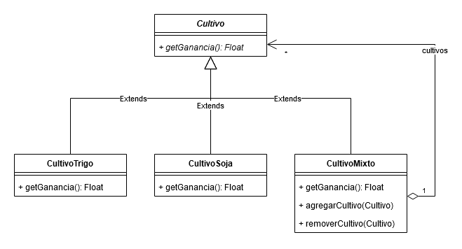
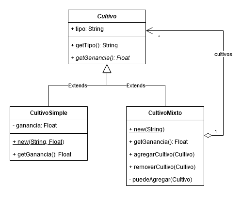
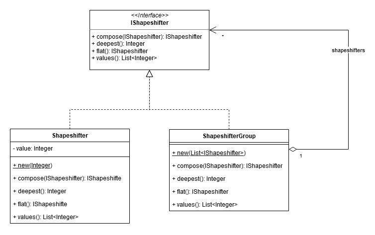

# TP08 - Composite

## 1. Cultivos

- Ver implementación.
-
- El agregado y borrado de hijos es implementado por la clase compuesta (_Composite_).
- Roles:
  - Component: `Cultivo`
  - Leaf:
    - `CultivoSoja`
    - `CultivoTrigo`
  - Composite: `CultivoMixto`
  - Client:
    - `CultivoSojaTest`
    - `CultivoTrigoTest`
    - `CultivoMixtoTest`

### Cultivos Alterados

- Roles:
  - Component: `Cultivo`
  - Leaf: `CultivoSimple`
  - Composite: `CultivoMixto`
  - Client:
    - `CultivoSimpleTest`
    - `CultivoMixtoTest`

## 2. Shapeshifter

- Roles:
  - Component: `IShapeshifter`
  - Leaf: `Shapeshifter`
  - Composite: `ShapeshifterGroup`
  - Client:
    - `ShapeshifterTest`
    - `ShapeshifterGroupTest`
- Ver implementación.
- Para el ejemplo A ver `ShapeshifterTest::testCompose` y para el ejemplo C ver `ShapeshifterGroupTest::testMultipleComposition`.
