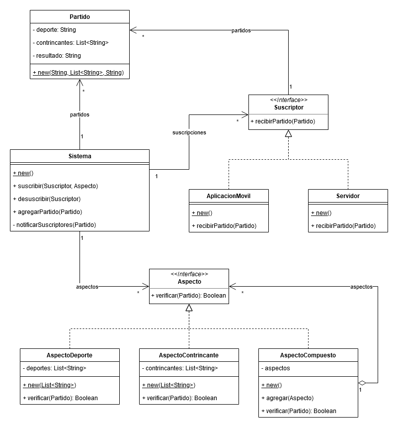
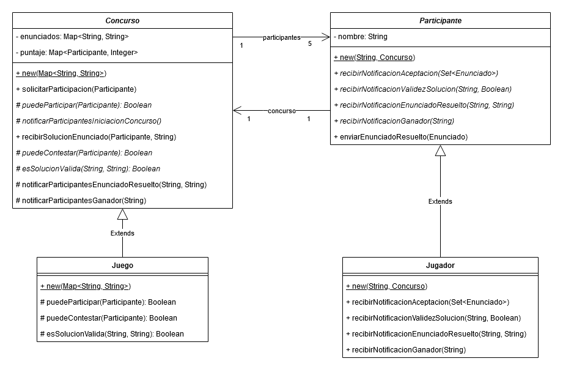

# TP08 - Observer

## 1. Diferentes Alternativas de Observer

- Simple Sensor

  Para observar a más de un sensor se podría agregar un mensaje `agregarSensor` a la clase `LlamadorBomberos` que a su vez se encargue de agregar la instancia actual de `LlamadorBomberos` a la collección de observadores del `Sensor` y además luego guarde la referencia al nuevo sensor en una colleccion interna del `LlamadorBomberos`. Otra alternativa es que el `Sensor` se enviara a sí mismo junto con la notificación de cambio y así el `LlamadorBomberos` sabría inmediatamente cuál instancia de `Sensor` fue la que originó la notificación.

- Complex With Listener

  La interfaz `SensorListener` nos estaría dando la libertad de poder observar cambios provenientes de cualquier instancia de `ComplexSensor` que sea de interés. Esto es gracias a que el método `humedadModificada` nos obliga a recibir como parámetro la instancia que está sufriendo la modificación.

- Complex Observer

  Éste es un caso similar al del _Simple Sensor_. Se podrían extender ambos observadores con un mensaje para agregar otras instancias de `ComplexSensor` a una collección interna de sujetos de interés o hacer que el `ComplexSensor` se envíe a sí mismo además del aspecto que provocó la notificación y con eso podríamos evitar el almacenar las referencias a múltiples sensores.

## 2. Publicaciones

- Se utilizó el patrón _Observer_ para modelar la interacción entre el `Sistema` y cada `Suscriptor`. Y, además, el patrón _Composite_ para modelar el `Criterio` de notificación que se debe revisar antes de enviar una notificación a un `Sucriptor` de parte del `Sistema`. El almacenar la asociación entre cada suscriptor y sus criterios de notificación nos ayuda a enviar solamente noticaciones de sumo interés para el suscriptor.

  - Roles patrón Observer:

    - Subject: se decidió por no implementar una abstracción del mismo
    - Observer: `Suscriptor`
    - ConcreteSubject: `Sistema`
    - ConcreteObserver: `Investigador`

  - Roles patrón Composite:

    - Component: `Criterio`
    - Leafs:
      - `CriterioTitulo`
      - `CriterioAutor`
      - `CriterioFiliacion`
      - `CriterioTipo`
      - `CriterioLugarPublicacion`
      - `CriterioPalabrasClave`
    - Composite: `CriterioCompuesto`

- Ver implementación Java en `SistemaTest` para ejemplos de funcionamiento.

## 3. Encuentros Deportivos

- Se utilizó el patrón _Observer_ para modelar la interacción entre el `Sistema` y cada `Suscriptor`. Y, además, el patrón _Composite_ para modelar el `Aspecto` sobre el cual un `Sucriptor` quiere ser notificado por el `Sistema`, sin importar la complejidad de los mismos. El almacenar la asociación entre cada suscriptor y sus aspectos de interés en el sistema nos ayuda a minimizar la cantidad de mensajes enviados a cada uno de ellos y solo enviarles notificaciones que realmente les sean de interés.

  - Roles patrón Observer:

    - Subject: se decidió por no implementar una abstracción del mismo
    - Observer: `Suscriptor`
    - ConcreteSubject: `Sistema`
    - ConcreteObserver:
      - `AplicacionMovil`
      - `Servidor`

  - Roles patrón Composite:

    - Component: `Aspecto`
    - Leafs:
      - `AspectoDeporte`
      - `AspectoContrincantes`
    - Composite: `AspectoCompuesto`

- Ver implementación Java en `SistemaTest` para ejemplos de funcionamiento.

## 4. Concurso de Preguntas y Respuestas

- Se utilizó el patrón _Observer_ para modelar las interacciones entre el concurso y sus participantes. Además se hizo uso del patrón _Template Method_ para definir el comportamiento general de un concurso para tener diferentes variedades de juegos (con más jugadores, diferentes reglas de puntuación, etc).

  - Roles patrón Observer:

    - Subject: `Concurso`
    - Observer: `Participante`
    - ConcreteSubject: `Juego`
    - ConcreteObserver: `Jugador`

  - Roles patrón Template Method:
    - AbstractClass: `Concurso`
      - TemplateMethods:
        - `Concurso::solicitarParticipacion`
        - `Concurso::recibirSolucionEnunciado`
      - Primitive Operations:
        - `Concurso::puedeParticipar`
        - `Concurso::notificarParticipantesIniciacionConcurso`
        - `Concurso::puedeContestar`
        - `Concurso::esSolucionValida`
        - `Concurso::esGanador`
      - Hook methods con comportamiento por defecto:
        - `Concurso::notificarParticipantesEnunciadoResuelto`
        - `Concurso::notificarParticipantesGanador`
    - ConcreteClass: `Juego`
