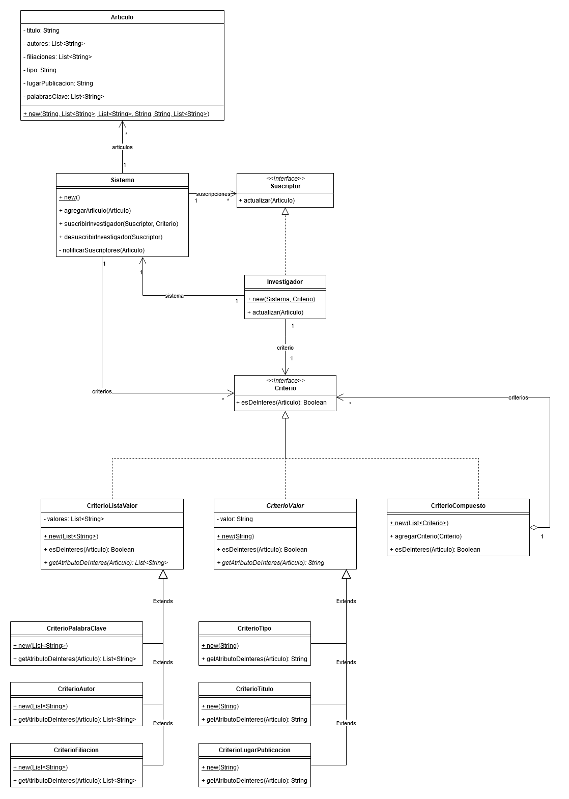

# TP08 - Observer

## 2. Publicaciones

- Se utilizó el patrón _Observer_ para modelar la interacción entre el `Sistema` y cada `Suscriptor` y el patrón _Composite_ para modelar el aspecto (`Criterio`) del cual un `Sucriptor` quiere ser notificado.

  - Roles patrón Observer:

    - Subject: se decidió por no implementar una abstracción del mismo
    - Observer: `Suscriptor`
    - ConcreteSubject: `Sistema`
    - ConcreteObserver: `Investigador`

  - Roles patrón Composite:
    - Component: `Criterio`
    - Leafs:
      - `CriterioTitulo`
      - `CriterioAutor`
      - `CriterioFiliacion`
      - `CriterioTipo`
      - `CriterioLugarPublicacion`
      - `CriterioPalabrasClave`
    - Composite: `CriterioCompuesto`

- Ver implementación en Java en `SistemaTest`.
- Ver implementación en Java.

## 3. Encuentros Deportivos
